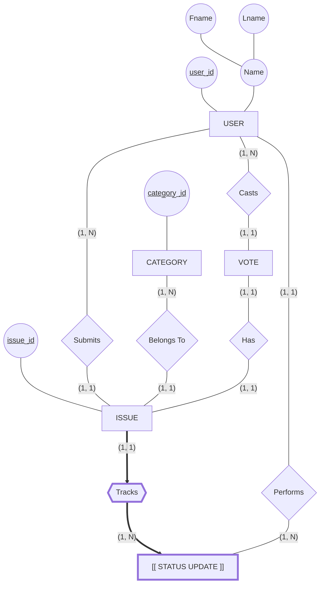

# Academic Database Entity Relationship Diagram (ERD)

```mermaid
graph TD
    %% Styling
    classDef weakEntity stroke-width:4px,stroke-dasharray: 0;
    classDef identifyingRel stroke-width:4px;
    classDef derivedAttr stroke-dasharray: 5 5;

    %% Entities
    User[USER]
    Category[CATEGORY]
    Issue[ISSUE]
    Vote[VOTE]
    StatusUpdate["[[ STATUS UPDATE ]]"]:::weakEntity

    %% Key Attributes
    U_Key(("u̲s̲e̲r̲_i̲d̲")) --- User
    C_Key(("c̲a̲t̲e̲g̲o̲r̲y̲_i̲d̲")) --- Category
    I_Key(("i̲s̲s̲u̲e̲_i̲d̲")) --- Issue

    %% Composite Attribute for User Name
    U_Name(("Name")) --- User
    U_FName(("Fname")) --- U_Name
    U_LName(("Lname")) --- U_Name
    
    %% Relationships
    Submits{Submits}
    Belongs{Belongs To}
    Casts{Casts}
    Has{Has}
    Tracks{{Tracks}}:::identifyingRel
    Performs{Performs}

    %% Connections
    User --- |"(1, N)"| Submits
    Submits --- |"(1, 1)"| Issue
    Category --- |"(1, N)"| Belongs
    Belongs --- |"(1, 1)"| Issue
    User --- |"(1, N)"| Casts
    Casts --- |"(1, 1)"| Vote
    Vote --- |"(1, 1)"| Has
    Has --- |"(1, 1)"| Issue
    Issue ==> |"(1, 1)"| Tracks
    Tracks ==> |"(1, N)"| StatusUpdate
    User --- |"(1, 1)"| Performs
    Performs --- |"(1, N)"| StatusUpdate
```
